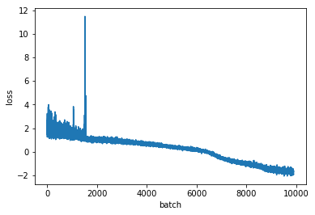
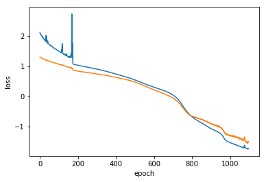
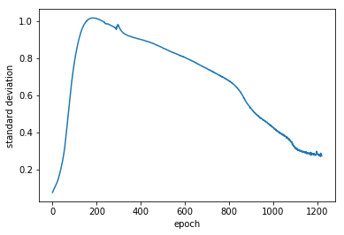

# Deep Architecture for Monitor Time Series

We want to predict the future of monitor time series.
If the predictions have low confidence or if the 
evidence has low confidence given the predictions,
bad things probably happen.

## Common Knowledge

There is a range of recurrent models of increasing obscurity to
deal with  time series prediction. All of them include a
recurrent unit which threads the state through the time steps,
accepts data as inputs and produces next step predictions as
outputs. The simplest model is just a RNN with a fully-connected
readout layer to produce predictions.

```
          x'[t+1] = mu[t+1], sigma[t+1]
              ^
              |
            -----
           / MLP \
          ---------
              ^
              |
              z[t]
              |
           +-----+    
  h[t-1]-->| RNN |-->h[t]-->
           +-----+
              ^
              |
              x[t]

```

RNN can be based on GRU, LSTM, or another variant, and is often
multi-layer. When there is more than a single layer,
non-recurrent connections are equipped with dropout units
for regularization:

```
            +---------+
  h[t-1,i]->| RNNCell |-> h[t, i]
            +---------+
                 ^
                 |
             +-------+    
             |Dropout|
             +-------+
                 ^
                 |
            +---------+
h[t-1,i-1]->| RNNCell |-> h[t, i-1]
            +---------+
```

Variants are stochastic RNNs, variational RNNs, etc. The
overall architecture stays almost the same, with more
connections, intermediate modules and sampling-based variational
layers.

### Input and Output

This architecture normally accepts data vectors and outputs
vectors of predictions of means and standard deviations (the
output is twice as wide as the input). Then, to generate a
forecast, one samples from N(mu, sigma) for each component, and
feeds the sample as the input to the next time step.

### Training

The model is trained to minimize LML of prediction. In the most
basic case, a single step is predicted for each time step in the
series. If a series has 10 steps, then steps 1 .. 9 are input,
and the steps 2 .. 10 are truth. The network is trained to
minimize negative log likelihood (NLL) of truth given
predictions under variational approximation of product of
gaussians.

Generating with sufficiently stable series will produce a high
likelihood forecast. If the series are noisy, one can run a few
samples for several steps, and use the sample mean and variance
as the forecast (both most likely outcome and confidence). 

## Differences of Our Approach

We are not interested in sampling from patient futures, but
rather in assessing stability of the patient condition and our
confidence about it.  We also need a way to deal with missing
data, which we have in abundance. We need an architecture which
incorporates confidence about data and in which observed and
predicted data are interchangable: if out of 5 components 3 were
measured and 2 predicted from an earlier step we want to input
them both into the next time step for further forecasting. In
addition, we are very serious about confidence levels, even more
than about the exact mean. This means we need to train on more
than a single, myopic, step.

_Here are our changes._

1. The input, as well as the output, is a vector of means followed
by standard deviations. If the data has 5 components, the input
will be 10-dimensional. For observed data --- measurements
present at the current time step --- the standard deviation is
zero. For missing data the input is mean and standard deviation
as predicted from the previous time step.

2. Since we introduce confidence into the input, we cannot train
the network myopically, on a single step prediction --- or the
standard deviations in the input data will always be zero, and
the network will never learn how to use them. To overcome this,
we train on multiple predicted steps. We feed each prediction,
without sampling, as input to the next step and compute the loss
as LML of this number of future points versus our prediction.

So, given the data set of 5 dimensions, the input has 10
dimensions. If we train with 3 time steps lookahead, the ground
truth will be a matrix of size 3x5. The prediction against
which the likelihood of this ground truth is computed will be
a matrix of size 3x10. Intuitively, we would expect the
predicted standard deviation to increase along the time axis
for each component.

### Input gaussianization

An additional improvement in prediction may apparently be
achieved by input gaussianization.  We implemented
componentwise input gaussianization via a variant of adversarial 
autoencoder: each covariate is encoded into a
normally-distributed representation (as predicted by the
previous time step) before being passed to the
recurrent module. This way, learning to predict the trend and
to ignore outliers is separated. Each component has to be
gaussianized independently to facilitate handling of missing
data during prediction.

In practice, the improvement was rather modest, at the cost of
more complex architecture and slower training and evaluation.
The plain RNN + readout architecture is able to learn to
both filter and predict sufficiently well.  We decided to stick
to the simpler architecture.

## Some results

We collected a data set of 60 min fragments from the monitor,
for a few combinations of components. Here are some results
for heart rate, blood presure, oxydation, and respiratory rate. Results
for fewer or more components have essentially the same
structure, just slightly different numbers. As an extreme case,
if we only take a single component, the heart rate, the network
learns to predict with variance 0.3, and stabilizes there.

All data are normalized component-wise to zero mean unit
variance. 

Train loss (the model is learning something):



Train vs test loss (no overfit):



Average standard deviation of prediction --- a measure of
confidence of predictions:



Standard deviation first goes up to 1 (the maximum reasonable
value given the data) and then decreases to a stable value. We
can actually constrain the standard deviation in the model, but
letting it converge where it pleases works well enough.

##  Setup used for predictions

The deep model has 3 layers of GRU, each with 128-dimensional
hidden state. Non-recurrent connections between GRUs have
dropout with probability of 0.5.  The readout layer has three
layers (hidden x hidden, hidden x hidden, hidden x output) with
ReLU non-linearity between the layers.  The model is trained
with 15 minute depth and applied with 15 minute lookahead for
prediction.
